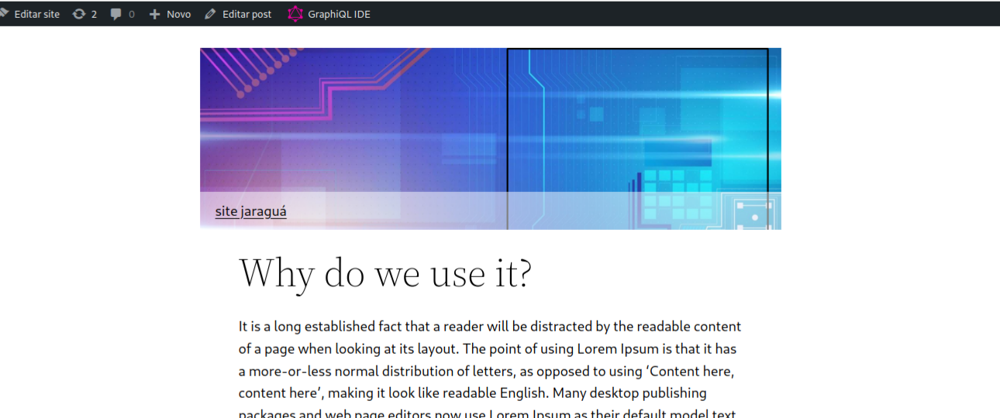
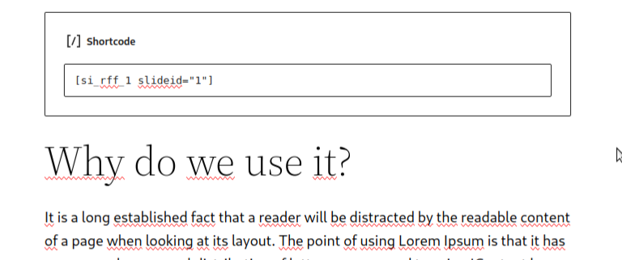
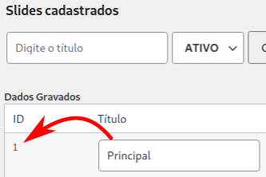
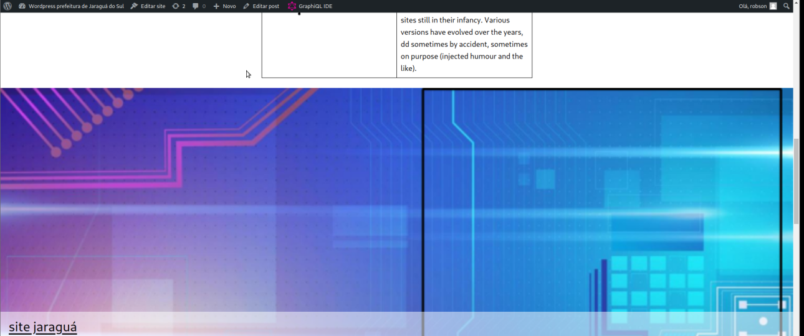
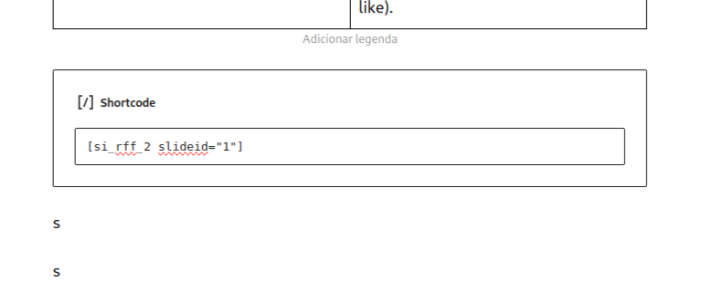
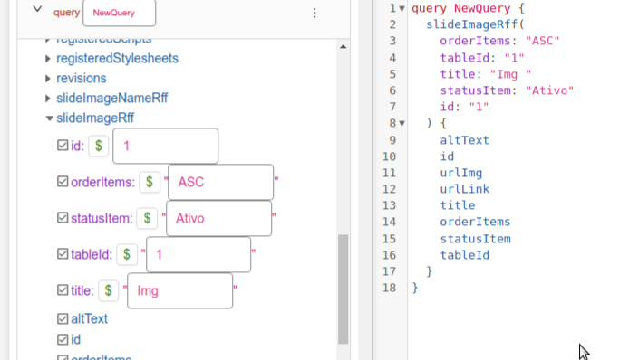

<html>
    <body>
        <h1>Informações importantes sobre o plugin Slide Image Rff</h1>
        <h2>
            Como usar o schortcode?
        </h2>
        

        

            - Modelo 1:
        

        

             
        

        

            Insira o código abaixo em um post ou página, conforme imagem abaixo:
            <pre>[si_rff_1 slideid="1"]</pre> 
             
            Aqui o slideid="1" indica que eu quero o slide com o id 1, para especificar qual slide quero usar. 
             
            Obs: O modelo 1 foi desenvolvido para ser inserido e executado com uma proporção de 750px X 235px, por isso, as imagens devem ter essa proporção
        

        

        

        

            - Modelo 2:
        

        

             
        

        

            Insira o código abaixo em um post ou página, conforme imagem abaixo:
            <pre>[si_rff_2 slideid="1"]</pre> 
             
            Note que foi inserido alguns parágrafos com a letra S, isso foi feito porque esse modelo fica supenso, então ele faz com que o conteúdo debaixo suba e fique por trás dele. Por isso, a quantidade de parágrafos com S que você vai colocar, vai depender da altura da sua imagem. 
            Aqui o slideid="1" indica que eu quero o slide com o id 1, para especificar qual slide quero usar. 
             
            Obs: O modelo 2 foi desenvolvido para ser inserido e executado com uma proporção de 100% da largura tela, a altura é ajustada automaticamente(Favor manter a mesma altura nas imagens), por isso, as imagens devem ter uma resolução boa
        

        

         
        <h2>Alguns detalhes sobre o uso do GraphQl</h2>
        

        

             
        

        

            <strong>Pesquisa no GraphQl:</strong> 
            <strong>Por ID (aparece na coluna ID da tabela de itens do slide) -> </strong>Digite o ID do item do slide para receber como retorno os dados desse item. 
            <strong>Por OrdenItems (ordem delimitada pelo campo orderItems no formulário) -> </strong>Digite ASC para ordem crescente ou DESC para ordem decrescente. 
            <strong>Por StatusItem (status do item) -> </strong>Digite Ativo para pegar os itens ativos e Inativo para pegar os inativos. 
            <strong>Por TableId (aparece na coluna ID da tabela de nome do slide) -> </strong>Digite o ID do slide para receber como retorno todos os itens daquele slide. 
            <strong>Por Title -> </strong>Digite o titulo, ou parte dele, que você receberá como retorno os itens que contiverem no campo title o texto digitado. 
            Você também pode combinar a pesquisa, mas cuidado, algumas combinações pode ser disperdício de processamento. 
        

        

         
        <h2>Mais detalhes</h2>
        
As instruções de como usar estão disponíveis no github, seguem os links importantes:

        

          Url do Github: <a href="https://github.com/robsonfdfarias/slide-imagem-rff" target="_blank">https://github.com/robsonfdfarias/slide-imagem-rff</a> 
          Linkedin do author: <a href="https://www.linkedin.com/in/robson-farias-a8b01723a/" target="_blank">Robson Farias</a> 
          Email de contato: robsonfdfarias@gmail.com 
          Canal do youtube: <a href="https://www.youtube.com/c/Inform%C3%A1ticacomRobsonFarias" target="_blank">Canal informática com Robson Farias</a> 
          Canal do youtube: <a href="https://www.youtube.com/@RobsonFarias-os2di" target="_blank">Robson Farias (code)</a> 
        
 
    </body>
</html>